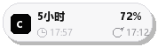
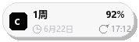
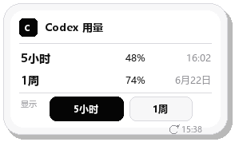
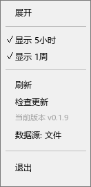
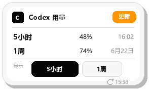
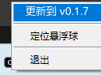
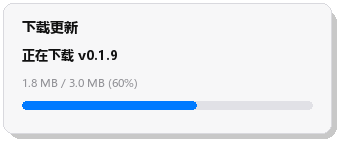

# Codex 额度悬浮球

这是一个 Windows 桌面悬浮球，用来显示本机 Codex 的额度信息。

当前版本：`v0.1.9`

当前版本只保留正确方案：读取本机 Codex 会话快照里的 `rate_limits`，不读取 cookie，不读取 token，不读取 `auth.json`，不调用远程额度接口，也不会把本机实时额度数据打进分享包。

## 预览

折叠态：




同时显示 5小时和 1周：


展开态：



右键菜单：



发现新版本时：






## 更新日志

### 未发布

暂无。

### v0.1.9 - 2026-06-16

- 更新入口改为应用内下载新版安装器：用户确认下载后显示下载进度，下载完成后再确认是否立即安装。
- 自动更新检查频率改为启动后约 15 秒检查一次，之后每 1 小时检查一次。
- 右键菜单新增置灰的当前版本项，方便确认正在运行的版本号。
- 折叠气泡里的额度重置时间改为更浅灰色，降低和主额度信息的视觉竞争。
- 双选紧凑折叠态改为固定列位排版，让 5小时/1周、剩余额度和重置时间的间隔更均匀。

### v0.1.8 - 2026-06-16

- 显示窗口改为复选，可只显示 5小时、只显示 1周，或同时显示两项。
- 折叠气泡中，钟表图标表示额度重置时间，循环图标表示数据刷新时间；同时显示两项时使用两行紧凑排版，刷新时间固定在右下角，避免切换时跳变。
- 修复点击“刷新”后会把当前显示从 1周切回 5小时的问题；刷新会主动读取一次本机会话快照，刷新时间显示数据快照时间。

### v0.1.7 - 2026-06-16

- 修复更新检查在 GitHub API 匿名限流时误报“网络连接失败”的问题，改为优先通过 GitHub Release 最新版本跳转解析版本。
- 发现新版本时，折叠态和展开态都会显示可点击的“更新”标记。
- 托盘图标会提示有新版本，右键托盘菜单提供“更新到 vX.Y.Z”入口。
- 构建、安装和卸载脚本减少容易被安全软件误报的写法，保持脚本行为更透明、可审计。

## 快速启动

1. 从 GitHub Release 下载 `codex-bubble-setup-v0.1.9.exe`。
2. 双击安装器完成安装；安装器会把程序放到当前用户目录，并创建桌面和开始菜单快捷方式。
3. 通过“Codex 额度悬浮球”快捷方式启动。
4. 如果显示“未连接”，额度和重置时间会显示为 `-`。先在这台电脑上使用 Codex 发一条消息，等待一分钟，或运行安装目录里的 `scripts/run_codex_local_usage_once.bat` 手动刷新一次。

## 安全边界

程序只读取本机 `.codex/sessions` 和 `.codex/archived_sessions` 下的会话快照文件，不会关闭、重启或控制 Codex 进程。

如果安装目录不可写，运行时配置、额度数据和日志会自动保存到 `%LOCALAPPDATA%\CodexBubble`。

## 多屏支持

悬浮球会识别 Windows 多显示器工作区，支持副屏在主屏左侧、右侧或上方的负坐标布局。拖到副屏后会保存当前位置；右键菜单会限制在鼠标所在屏幕内，不会弹到主屏之外看不见的地方。

如果分辨率变化、显示器拔插或重新登录后找不到悬浮球，可以双击系统托盘里的 Codex 图标。悬浮球会回到当前可用屏幕，并显示“悬浮球在这里”的提示。

悬浮球不会占用任务栏按钮，只保留系统托盘图标作为找回和退出入口。

## 在线更新

软件启动后约 15 秒会安静检查一次 GitHub 最新 Release，之后每 1 小时自动检查一次；也可以右键悬浮球选择“检查更新”手动检查。

如果发现新版本，折叠态和展开态都会显示“更新”标记；系统托盘图标也会提示有新版本，右键托盘可以直接更新。点击更新后会先确认下载，新版安装器会下载到临时目录并显示进度；下载完成后再次确认是否立即安装。安装器会先退出旧版悬浮球和后台同步器，再安装新版。

## 单实例运行

应用默认不允许多开。重复双击 `启动悬浮球.bat` 时，已经运行的悬浮球会继续保留，新的悬浮球和后台同步器会自动退出。

## 卸载

安装目录里包含 `卸载悬浮球.bat`。也可以在开始菜单点击“卸载 Codex 额度悬浮球”。

卸载会退出悬浮球和后台同步器，删除安装目录和快捷方式；运行时配置、日志和额度缓存暂时保留在 `%LOCALAPPDATA%\CodexBubble`，方便后续重装继续使用原配置。

## 项目结构

```text
.
├─ 启动悬浮球.bat                 # 普通用户双击入口
├─ 卸载悬浮球.bat                 # 安装目录中的卸载入口
├─ src/codex_bubble/              # Python 源码
├─ config/                        # 默认配置
├─ data/                          # 本机生成的额度数据，不提交
├─ logs/                          # 运行日志，不提交
├─ scripts/                       # 英文维护脚本
├─ docs/                          # 中文使用、安全和方案文档
├─ scripts/installer/              # Windows 安装器内部安装脚本
├─ releases/                      # 本地构建输出，Git 不提交
├─ VERSION                         # 当前版本号
├─ CHANGELOG.md                    # 更新日志
└─ AGENTS.md                      # Agent/开发者协作规范
```

## 常用脚本

- `启动悬浮球.bat`：开发或安装目录里的启动入口，启动后台同步器和桌面悬浮球。
- `卸载悬浮球.bat`：安装目录里的卸载入口，删除应用文件和快捷方式。
- 悬浮球启动时也会自动确保后台同步器在运行；重复启动会被单实例锁拦住，不会多开。
- `scripts/run_codex_local_usage_once.bat`：手动读取一次本机 Codex 会话快照。
- `scripts/start_codex_usage_daemon_local.bat`：只启动后台同步器。
- `scripts/install_local_usage_startup.ps1`：安装开机启动。
- `scripts/uninstall_local_usage_startup.ps1`：取消开机启动。

## 开发方向

后续开发请优先阅读 `AGENTS.md`。核心方向是：保持本地、安全、轻量，Release 面向普通用户提供安装器，继续打磨 Windows 桌面体验，而不是接入敏感账号凭据、远程接口或会影响 Codex 进程的控制逻辑。
